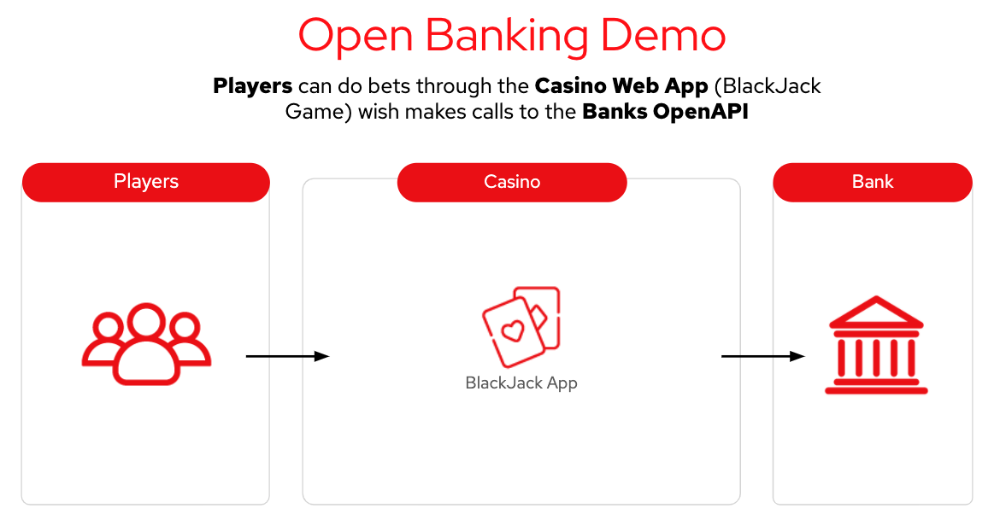
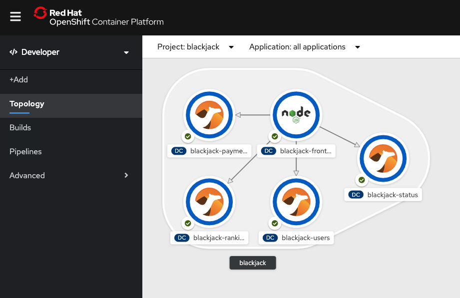
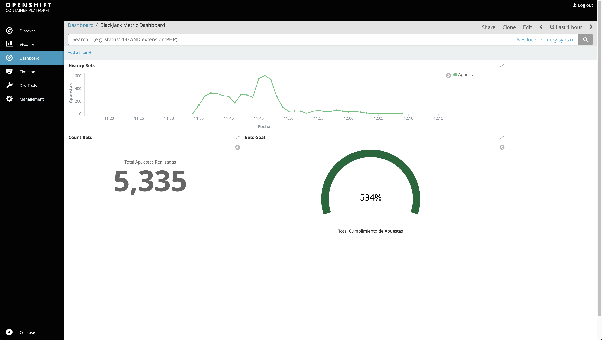

# Openbanking at Scale - Black Jack

### Demo Overview
This demo focused in demonstrate in a simple and easy way how to manage a simple MSA solution for Open Banking, adding some fun playing Black Jack.

We use [Red Hat Openshift Platform](https://www.redhat.com/es/technologies/cloud-computing/openshift) for deploying the apps wich are based on [Red Hat middleware container runtimes](https://developers.redhat.com/products/rhoar/overview) like Node.js, SpringBoot and [Red Hat Fuse](https://developers.redhat.com/products/fuse/overview). 

Also use we use a OpenBanking API Backend called [Open Bank Project](https://www.openbankproject.com/).



**Credits:** 
* Tomás Gübeli - [https://github.com/tgubeli](https://github.com/tgubeli) 
* Francisco Meneses - [https://github.com/fmenesesg](https://github.com/fmenesesg) 
* Paulo Seguel - [https://github.com/pseguel](https://github.com/pseguel) 
* Chrystian Duarte - [https://github.com/ChrystianDuarte](https://github.com/ChrystianDuarte) 

**Event:** Red Hat Tech Exchange Oct 2019 - Openbank at Scale Team 

**Third party OSS project:** [OpenBankProject](https://www.openbankproject.com/)

# How to deploy this DEMO

*** This demo was tested with Openshift version 4.3 and 4.4 ***

What you will need:
 - An Openshift 4.4 cluster
	 - You can deploy one in your laptop installing the latest version of OKD or CodeReady Containers. 
		 - OKD: **[https://www.okd.io](https://www.okd.io/)**
		 - CodeReady Containers: **[https://developers.redhat.com/products/codeready-containers/overview](https://developers.redhat.com/products/codeready-containers/overview)**
- Openshift CLI installed in your machine:
	- Mac: https://mirror.openshift.com/pub/openshift-v4/clients/ocp/latest/openshift-client-mac.tar.gz
	- Windows: https://mirror.openshift.com/pub/openshift-v4/clients/ocp/latest/openshift-client-windows.zip
	- Linux: https://mirror.openshift.com/pub/openshift-v4/clients/ocp/latest/openshift-client-linux.tar.gz

## Deploying
Login in into your OCP cluster
```
oc login <ocp_api_url>
```

Then create the projects for Blackjack Game and Open Bank Project API (obp)
```
oc new-project obp-data
oc new-project obp-api
oc new-project blackjack
```

### Install and configure ServiceMesh stuff
1. Install ISTIO (Openshift Service Mesh)
First at all you need to have Openshift Service Mesh deployed in your Cluster. 
Follow the steps in this link to do so:
[https://docs.openshift.com/container-platform/4.4/service_mesh/service_mesh_install/preparing-ossm-installation.html](https://docs.openshift.com/container-platform/4.4/service_mesh/service_mesh_install/preparing-ossm-installation.html)

Just install Service Mesh, don't configure Member Roles and Members. We are going to do that in the next step.

2. Add Maistra ServiceMeshMemberRoll
	Once you have Service Mesh installed and running in your Openshift Cluster, you must add our projects to the Maistra Service Mesh Member Roll. Just execute the following command:
	```
	oc create -n istio-system -f maistra-member-roll.yaml
	```
	
3. Create Istio Gateways and Virtual Services in the projects
First you need to edit some values in obp-virtual-services.yaml and blackjack-virtual-services.yaml. Just need to replace the string "<YOUR_WILDCARD_OCP_CLUSTER_DOMAIN>” with your domain wildcard: Example: if your OCP DNS Wildcard is “*.apps.cluster-demo.demo.example.opentlc.com”, just replace "<YOUR_WILDCARD_OCP_CLUSTER_DOMAIN>” with “.apps.cluster-demo.demo.example.opentlc.com”.
Then you can create the Gateways and VirtualServices:
	```
	oc apply -n obp-api -f obp-virtual-services.yaml
	oc apply -n blackjack -f blackjack-virtual-services.yaml
	```

4. Create BlackJack and OBP public URL (Routes):
We are going to route every external call through the Istio’s Service called "istio-ingressgateway”:
	```
	oc expose -n istio-system svc/istio-ingressgateway —hostname=blackjack.<YOUR_WILDCARD_OCP_CLUSTER_DOMAIN>
	```

## Deploying the Apps

### Clone git repo
```
git clone [https://github.com/tgubeli/blackjack.git](https://github.com/tgubeli/blackjack.git#master)
cd blackjack/scripts/obp
```

### Deploy OBP Data Base
```
oc project obp-data
oc new-app --template=postgresql-persistent --param=NAMESPACE=openshift --param=DATABASE_SERVICE_NAME=postgresql --param=POSTGRESQL_USER=obpuser --param=POSTGRESQL_PASSWORD=obppassword --param=POSTGRESQL_DATABASE=obpuser --param=POSTGRESQL_VERSION=9.6
```

### Deploy OBP API
```
oc project obp-api
oc create -f obp-template-demojam
oc process obp-api-example | oc create -f -
```

#### Restore data from Dump file
1. Port forward the Portgres Pod:
	```
	oc project obp-data
	oc get pods
	```
	You should see something like:
	```
	postgresql-1-pdsvc
	```
	Copy the pod's name and execute :
	```
	oc port-forward postgresql-1-pdsvc 5432:5432
	```
	Now your local machine are listening request through "localhost:5432" just like the postgres instance where installed locally.
	
2. Do the data restore:
	Open DBeaver desktop client
	Connect to DB (localhost:5432/obpuser) (Postgres 9.6 Driver)
	Right clic over DB > Tools > Restore
	Select dump file and restore
	More info: [https://www.youtube.com/watch?v=S5Zx8Lf9-Aw](https://www.youtube.com/watch?v=S5Zx8Lf9-Aw)

3. Add resources quota to Postgres DB
	```
	oc set resources dc/postgresql --limits=memory=3Gi,cpu=2 -n obp-data
	```

### Deploy Blackjack APIs
```
oc project blackjack
oc apply -f [https://raw.githubusercontent.com/jboss-fuse/application-templates/2.1.x.redhat-7-4-x/fis-image-streams.json](https://raw.githubusercontent.com/jboss-fuse/application-templates/2.1.x.redhat-7-4-x/fis-image-streams.json) -n openshift
oc new-app fuse7-java-openshift:1.4~[https://github.com/tgubeli/blackjack.git#master](https://github.com/tgubeli/blackjack.git#master) --context-dir=blackjack-status --name=blackjack-status
oc new-app fuse7-java-openshift:1.4~[https://github.com/tgubeli/blackjack.git#master](https://github.com/tgubeli/blackjack.git#master) --context-dir=blackjack-users --name=blackjack-users
oc new-app fuse7-java-openshift:1.4~[https://github.com/tgubeli/blackjack.git#master](https://github.com/tgubeli/blackjack.git#master) --context-dir=blackjack-payment --name=blackjack-payment
oc new-app fuse7-java-openshift:1.4~[https://github.com/tgubeli/blackjack.git#master](https://github.com/tgubeli/blackjack.git#master) --context-dir=blackjack-ranking --name=blackjack-ranking
```

### Deploy Blackjack Frontend
Fork [https://github.com/tgubeli/blackjack.git](https://github.com/tgubeli/blackjack.git) (you will need an GitHub account)
Edit blackjack.js and dashboard.js (.../edit/master/public/blackjack.js and .../edit/master/public/dashboard.js)
Find and change "GUID" variable value to your host.
Example: var guid = 'demojam-8b2e';

> Hint: if you don't know what to put en GUID variable, just edit the variable "api_url" and "api_ranking". 

**Commit and push**
```
oc new-app nodejs:10~https://github.com/<your_git_hub_user>/blackjack.git  --context-dir=blackjack-frontend --name=blackjack-frontend
```
**Example:**
```
oc new-app nodejs:10~https://github.com/tgubeli/blackjack.git#master --context-dir=blackjack-frontend --name=blackjack-frontend
```

#### Change default Services port and port-name
```
oc apply -f blackjack-services.yaml
```

#### Add istio side car label to Deployment Configs
```
oc patch -n blackjack dc/blackjack-frontend -p '[{"op": "replace", "path": "/spec/template/metadata/annotations", "value":{"sidecar.istio.io/inject":"true"}}]' --type=json
oc patch -n blackjack dc/blackjack-payments -p '[{"op": "replace", "path": "/spec/template/metadata/annotations", "value":{"sidecar.istio.io/inject":"true"}}]' --type=json
oc patch -n blackjack dc/blackjack-status -p '[{"op": "replace", "path": "/spec/template/metadata/annotations", "value":{"sidecar.istio.io/inject":"true"}}]' --type=json
oc patch -n blackjack dc/blackjack-users -p '[{"op": "replace", "path": "/spec/template/metadata/annotations", "value":{"sidecar.istio.io/inject":"true"}}]' --type=json
oc patch -n blackjack dc/blackjack-ranking -p '[{"op": "replace", "path": "/spec/template/metadata/annotations", "value":{"sidecar.istio.io/inject":"true"}}]' --type=json
oc patch -n obp-api deployment obp-deployment -p '[{"op": "replace", "path": "/spec/template/metadata/annotations", "value":{"sidecar.istio.io/inject":"true"}}]' --type=json
oc patch -n obp-data dc/postgresql -p '[{"op": "replace", "path": "/spec/template/metadata/annotations", "value":{"sidecar.istio.io/inject":"true"}}]' --type=json
```
  
**Adding some labels ...**
```
oc project blackjack && \
oc label dc/blackjack-users app.openshift.io/runtime=camel --overwrite && \
oc label dc/blackjack-payment app.openshift.io/runtime=camel --overwrite && \
oc label dc/blackjack-ranking app.openshift.io/runtime=camel --overwrite && \
oc label dc/blackjack-status app.openshift.io/runtime=camel --overwrite && \
oc label dc/blackjack-frontend app.openshift.io/runtime=nodejs --overwrite && \
oc label dc/blackjack-users app.kubernetes.io/part-of=blackjack --overwrite && \
oc label dc/blackjack-payment app.kubernetes.io/part-of=blackjack --overwrite && \
oc label dc/blackjack-ranking app.kubernetes.io/part-of=blackjack --overwrite && \
oc label dc/blackjack-status app.kubernetes.io/part-of=blackjack --overwrite && \
oc label dc/blackjack-frontend app.kubernetes.io/part-of=blackjack --overwrite && \
oc annotate dc/blackjack-frontend app.openshift.io/connects-to=blackjack-users,blackjack-payment,blackjack-status,blackjack-ranking
```
```
oc project obp-api && \
oc label deployment obp-deployment app.openshift.io/runtime=java --overwrite && \
oc label deployment obp-deployment app.kubernetes.io/part-of=obp-api --overwrite
```
```
oc project obp-data && \
oc label dc/postgresql app.openshift.io/runtime=postgresql --overwrite && \
oc label dc/postgresql app.kubernetes.io/part-of=obp-api --overwrite
```

Now in the Openshift Web Console go to  Developer view > Topology. The blackjack project should be look like this:



Enjoy you Black Jack Game with others now!

Go to your browser:
Game: http://blackjack.apps.<YOUR_OCP_WILDCARD_DNS>/blackjack.html 
(this URL can be obtain from Projects > istio-system > Networking > Routes)

Top Ten users: http://blackjack.<YOUR_OCP_WILDCARD_DNS>/dashboard.html

## Optional: Create a business Dashboard with Kiali
Open Kali web console (Administration View > Monitoring > Logging) and after some calls (bets from BlackJack Frontend UI) you should see something like this:


## Optional: Enable Autoscalling
In order to add autoscalling capabilities to a POD, for example a blackjack POD (payment or user services), we need to autoscale obp-api POD too and add some parameter to Postgres DB (obp-data).
 
1. Add Readiness Probe & Resource Limits:
-   obp-api: /obp/v4.0.0/rate-limiting, port: 8080, initial delay: 98, timeout: 5
-   obp-api: cpu-limit: 1core, min-mem:700mb, mem-limit: 2Gi
-   blackjack-payment: /blackjack/api, port: 8080, initial delay: 50, timeout: 4
-   blackjack-payment: cpu-limit: 700mi, mem-limit: 2Gi

	```
	oc project blackjack
	oc set probe dc/blackjack-payment --readiness --get-url=http://:8080/blackjack/api --initial-delay-seconds=30 --timeout-seconds=4
	oc set resources dc/blackjack-payment --limits=memory=2Gi,cpu=1
	oc set resources dc/blackjack-users --limits=memory=2Gi,cpu=1
	```

2. Change obi-api pod replicas from 1 to 2
	```
	oc scale deployment obp-deployment --replicas=2 -n obp-api
	```
3. Add autoscaling to blackjack-payment dc from 2 pods to 10
	```
	oc autoscale dc/blackjack-payment --min 2 --max 10 --cpu-percent=80 -n blackjack
	oc autoscale dc/blackjack-users --min 3 --max 10 --cpu-percent=80 -n blackjack
	```
